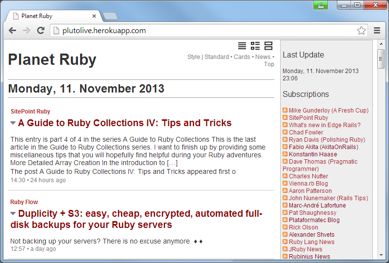

# {{ page.title }}

Contents:

* [What's Pluto?](#whatis)
* [Getting Started](#start)
* [Planet Configuration Sample](#config)
* [About, License](#about)
* [Questions? Comments?](#questions)

## What's Pluto?   {#whatis}

A planet site generator in ruby that lets you build web pages from published web feeds.

## Getting Started    {#start}

Use the `pluto` command line tool and pass in one or more planet configuration files.
Example:

~~~
$ pluto build ruby.ini       or
$ pluto b ruby
~~~

This will

1) fetch all feeds listed in `ruby.ini` and 

2) store all entries in a local database, that is, `ruby.db` in your working folder and

3) generate a planet web page, that is, `ruby.html` using the [`blank` template pack](https://github.com/feedreader/pluto.blank) in your working folder using all feed entries from the local database.

Open up `ruby.html` to see your planet web page. Voila!

### Bonus: Try some different templates/theme packs

- Blank - default templates; [more »](https://github.com/feedreader/pluto.blank)
- News - 'river of news' style templates; [more »](https://github.com/feedreader/pluto.news)
- Top -  Popurl-style templates; [more »](https://github.com/feedreader/pluto.top)
- Classic -  Planet Planet-Style templates; [more »](https://github.com/feedreader/pluto.classic)

## Planet Configuration Sample   {#config}

`ruby.ini`:

~~~
title = Planet Ruby

[rubyflow]
  title  = Ruby Flow
  link   = http://rubyflow.com
  feed   = http://feeds.feedburner.com/Rubyflow?format=xml

[rubyonrails]
  title = Ruby on Rails Blog
  link  = http://weblog.rubyonrails.org
  feed  = http://weblog.rubyonrails.org/feed/atom.xml

[viennarb]
  title = vienna.rb Blog
  link  = http://vienna-rb.at
  feed  = http://vienna-rb.at/atom.xml
~~~

For more samples, see [`nytimes.ini`](https://github.com/feedreader/pluto.samples/blob/master/nytimes.ini),
[`js.ini`](https://github.com/feedreader/pluto.samples/blob/master/js.ini),
[`dart.ini`](https://github.com/feedreader/pluto.samples/blob/master/dart.ini),
[`haskell.ini`](https://github.com/feedreader/pluto.samples/blob/master/haskell.ini),
[`viennarb.ini`](https://github.com/feedreader/pluto.samples/blob/master/viennarb.ini),
[`beer.ini`](https://github.com/feedreader/pluto.samples/blob/master/beer.ini),
[`football.ini`](https://github.com/feedreader/pluto.samples/blob/master/football.ini).

## Real World Usage  

[`pluto.live`](https://github.com/feedreader/pluto.live) - sample planet site; sinatra web app in ruby using the pluto gem

## About, License   {#about}

Gerald Bauer and contributors designed and developed the `pluto` gem.
See the change log for contributions and credits.

License. The pluto scripts and templates are dedicated to the public domain.
Use it as you please with no restrictions whatsoever.


